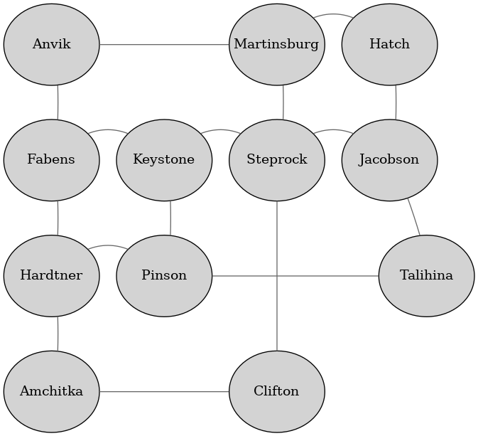
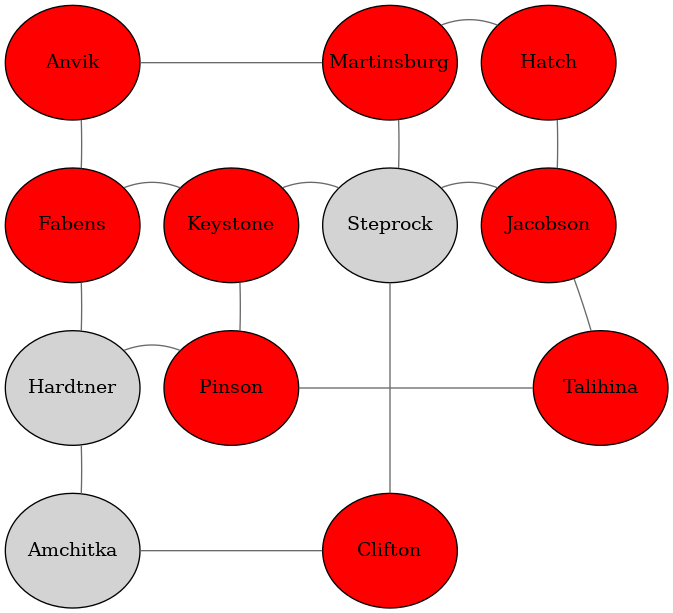

# Alien Invasion Simulation

A command line util created to simulate an alien invasion described in the [task](./TASK.md).

## Requirements
- Go 1.17
- Graphviz (optional)

## Usage

### Build
```
$ go build -o alien-invasion main.go
```

### Test
```
$ go test -v -cover ./...
```

### Generate a map

The process of the generation is following:
1. A grid of size height x width is created.
2. Provided number of cities is randomly placed on the grid.
3. If two cities are in the same row (west or east from each other) or column (north or south from each other) and there are no other cities between them, a road is created.

Additionally a dot format graph can be generated to visualize a map.

```
$ ./alien-invasion generate -h
Generate a world map

Usage:
  alien-invasion generate [output map file] [flags]

Flags:
  -c, --cities int   cities count (default 20)
  -d, --dot string   output dot file (graphviz format)
      --height int   grid height (default 5)
  -h, --help         help for generate
      --width int    grid width (default 5)
```

### Run a simulation

Simulation uses a generated map. The first step is to pick random a random location for each alien.
More than one alien can be placed in a city. If such situation occurs, the city is destroyed along with the aliens before they start to move. In every iteration all aliens move to a new location by following links (if not trapped in a city) at the same time. Simulation rules are enforced as a next step. The simulation is finished after a specified iteration limit or when there are not aliens or cities left.

```
$ ./alien-invasion run -h
Run simulation

Usage:
  alien-invasion run [input map file] [flags]

Flags:
  -a, --aliens int       aliens count (default 50)
  -h, --help             help for run
  -i, --iterations int   iterations limit (default 10000)
  -o, --output string    output world map file (printed to STDOUT by default)
```

### Analyze the simulation result

The simulation result can be visualized by Graphviz. Analyze command can be used to generate a graph with destroyed cities marked red. It is done by compering the initial map to the result maps and adjusting the initial dot graph.

```
$ ./alien-invasion analyze -h
Generate a graph in dot format from the simulation result with destroyed cities marked red.

Usage:
  alien-invasion analyze [initial map file] [result map file] [initial dot file] [output dot file] [flags]

Flags:
  -h, --help   help for analyze
```

## Complete example
The first step is to generate a map. Additionally the `generate` command can create a graph in dot format, which can be visualized using Graphviz. This step can be accomplished by running:
```
./alien-invasion generate world.map --dot world.dot --height 4 --width 4 --cities 12
```

Content of `world.map` file will be similar to:
```
$ cat world.map
Anvik south=Fabens east=Martinsburg
Hatch south=Jacobson west=Martinsburg
Keystone south=Pinson east=Steprock west=Fabens
Steprock north=Martinsburg south=Clifton east=Jacobson west=Keystone
Jacobson north=Hatch south=Talihina west=Steprock
Martinsburg south=Steprock east=Hatch west=Anvik
Fabens north=Anvik south=Hardtner east=Keystone
Hardtner north=Fabens south=Amchitka east=Pinson
Pinson north=Keystone east=Talihina west=Hardtner
Talihina north=Jacobson west=Pinson
Amchitka north=Hardtner east=Clifton
Clifton north=Steprock west=Amchitka
```

Optionally the map can be visualized by Graphviz by running:
```
$ dot -Tpng world.dot > world.png
```

Generated `world.png` will look similar to:


The next step is to run the actual simulation:
```
$ ./alien-invasion run world.map --aliens 24 --output result.map
Alien invasion started!
Fabens has been destroyed by Gokvor-Wicqu Rubwe, Piiz'Roof Qaafhus and Boygu-Zuk Kol!
Jacobson has been destroyed by Veemza'Coogku Wiizzaq and Pujqi Rucbuv Kaqji!
Martinsburg has been destroyed by Maauwef'Kuun Tiiklum and Yeefdov-Liifge Wiimrux!
Clifton has been destroyed by Ham-Wefqon Xuqqek and Raadzuc-Yiikheu Voow!
Anvik has been destroyed by Diuse'Uoclu Bulvi and Palbu'Bir Paxra!
Pinson has been destroyed by Seemfas-Caaltih Seem, Uel'Puknof Rog, Xad'Fecye Kodva and Siijuu'Boomnaq Peen!
Talihina has been destroyed by Diuse-Likwo Javda and Pecgad'Niqbej Livqic!
Hatch has been destroyed by Zaance Vooqfe Ueehmuv and Gibpof'Tut Ronxuj!
Keystone has been destroyed by Pucva'Vim Yac and Qiix Yiix Neezva!
Alien invasion finished!
```

Content of `result.map` file represents a partially destroyed world map after running the simulation:
```
$ cat result.map 
Hardtner south=Amchitka
Amchitka north=Hardtner
Steprock
```

Optionaly the partially destroyed world map can be visualized by Graphviz by running:
```
$ ./alien-invasion analyze world.map result.map world.dot result.dot \
    && dot -Tpng result.dot > result.png
```

Generated `result.png` will look similar to:


## Notes
- A predefined set of 10000 city names is used by the map generator ([source](https://raw.githubusercontent.com/tflearn/tflearn.github.io/master/resources/US_Cities.txt)).
- City names in the input maps cannot contain whitespaces.
- A predefined set of 75 alien names in used by the simulation ([source](https://gist.github.com/christabor/2b27a9e69e1f77ce6d65f039694903de)). For a greater count aliens are named Alien 1, Alien 2 etc.
- A full validation of the user input is missing.
- Test were created to outline the approach and only cover fraction of simulation functionality. `generate` and `analyze` commands do not have tests (functionality not in the scope of task).
- Unix nano timestamp is used as a random seed. In order to be able to precisely execute advanced test scenarios of the simulation, random number generation should be injected as a dependency (mock used in tests).
